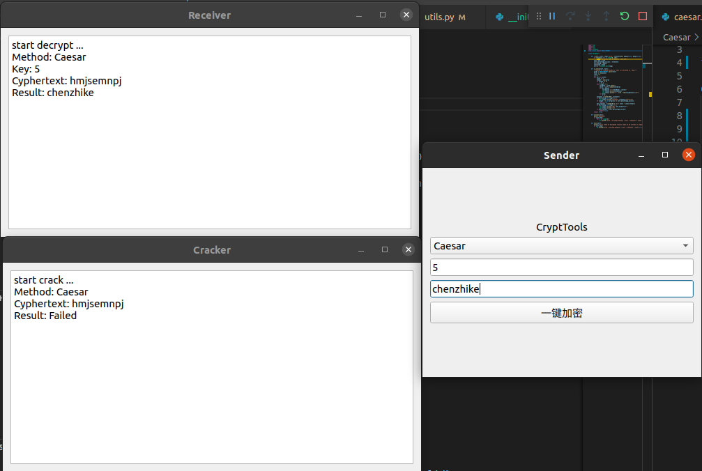

## Crypt-Tool

#### Homework For Computer Safety

#### Several Symmetric-key algorithm including traditional and learning methods

- Ceaser
- Advanced Encryption Standard 
- Scytale
- Vigenere
- GAN

#### Three Windows

- Sender  choose algorithm and key to translate plaintext  into cyphertext
- Receiver known algorithm and key to translate cyphertext back to plaintext
- Listener known algorithm without key 

#### Run the code 
pip3 install --upgrade pip
pip3 install -r requirement.txt
python3 visualization.py
